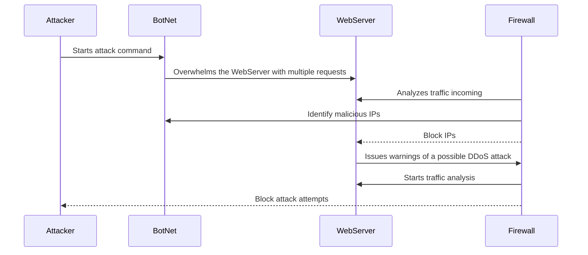

## 1. Threat actors starts the attack using a BotNet
- After targeting devices such as IoT, Network, or even Operation Technology, threat actors use these numerous compromised devices to start multiple requests at the same time on a web server. 
- It is estimated that a one million botnet devices can easily send requests of 4 terabits per second in a DDoS attack. 

## 2. Firewalls (router) detects this big movement of traffic. 
- By analyzing and filtering all requests and traffic sent via protocols, the firewall will be able to determine what is the next step. 

## 3. Firewall detects potencial threat IPs
- As soon as the botnet is flooding the Webserver with thousands of requests, a good firewall can discover which IP addresses are malicous. 

## 4. Malicous IPs are blocked 
- If the firewall discovers which IPs are responsible for the multiple flooding request, they will be blocked, so these IPs wont be able to reach the server anymore. 
## 5. Warning of a possible DDoS attack from WebServer to Firewall 
- The WebServer detects the unusual load and alerts the Firewall regarding the potential DDoS attack, providing details on the traffic spikes and affected resources.

## 6. Firewall starts a conduct analysis 
- The firewall investigates the source of the attack and potential future risks, so determining if any indeed action is needed to protect the server. 

## 7. Attack attempts are extermined 
- Finally, the Firewall blocks further attack attempts from the Attacker, ensuring that the WebServer can maintain its operations and mitigate the effects of the DDoS attack.